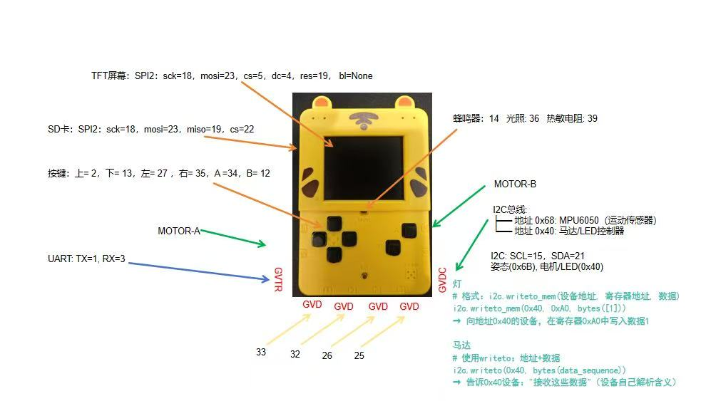
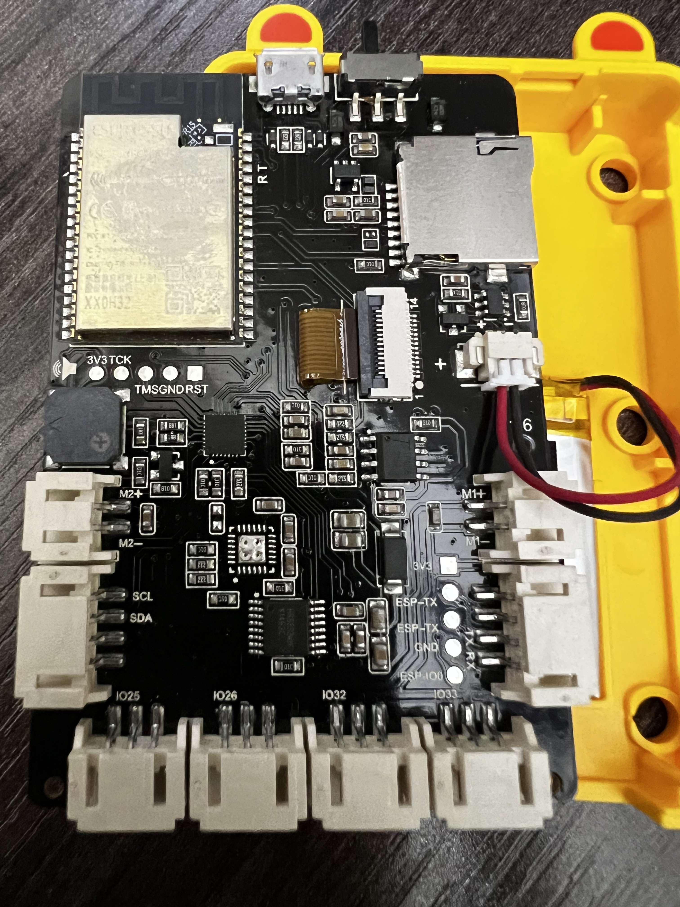
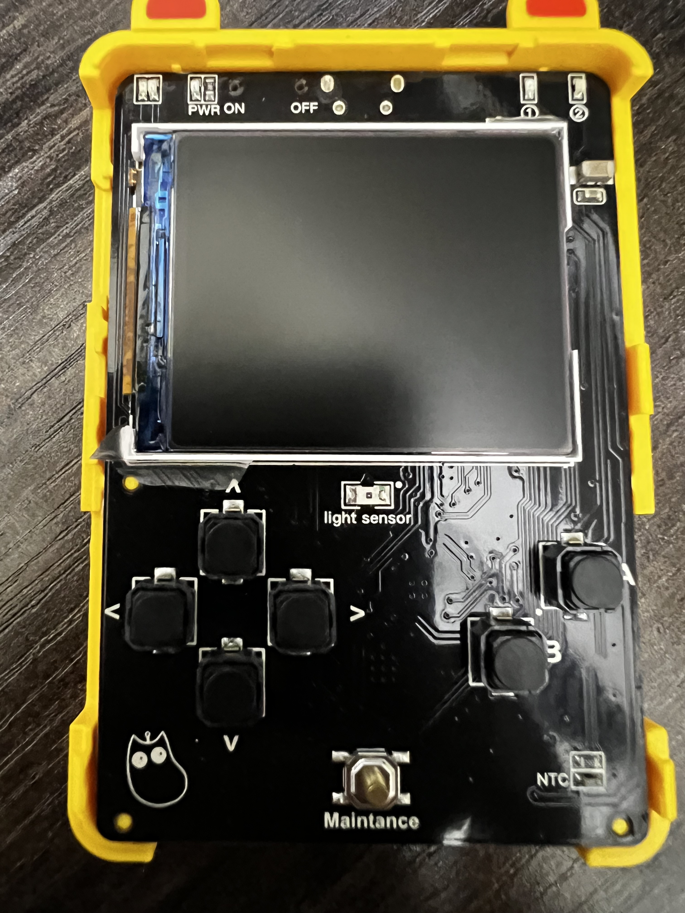
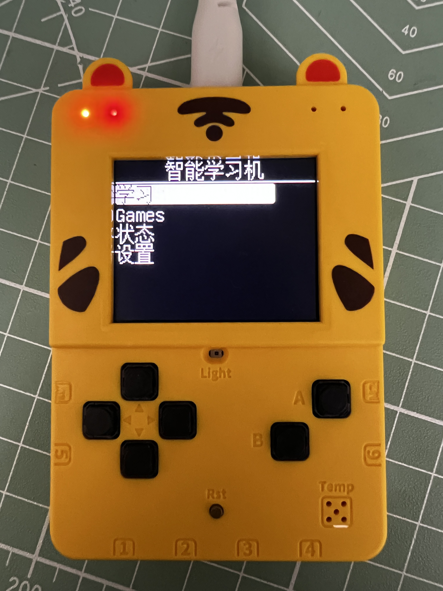
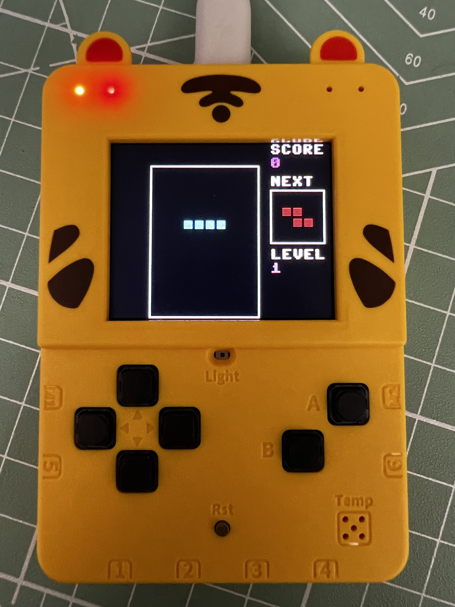
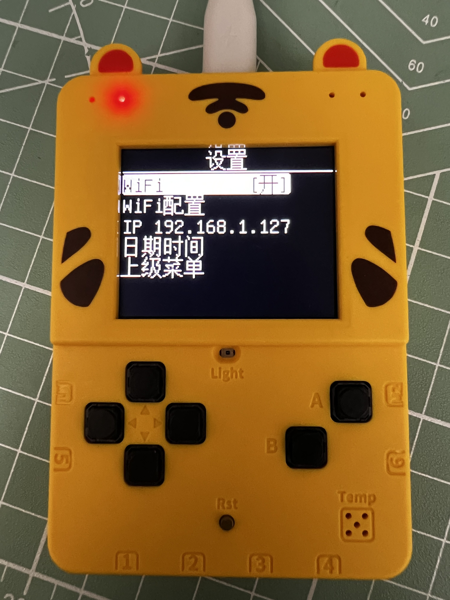

# 学而思小喵 — ESP32 MicroPython 学习机

基于 ESP32 和 ST7735 TFT 显示屏的 MicroPython 学习机，面向儿童，提供菜单驱动的交互界面，支持算术练习、口诀记忆、单词学习、小游戏和设备设置。

## 硬件

| 组件 | 说明 |
|------|------|
| 主控 | ESP32（SPIRAM 版本） |
| 屏幕 | ST7735 160x128 TFT，SPI 接口，帧缓冲驱动 |
| 按键 | 6 个：上/下/左/右 + A/B，GPIO 直接轮询 |
| 外设 | 扬声器(PWM)、光敏电阻(ADC)、温度传感器(ADC)、SD卡(SPI)、UART、I2C |

引脚定义见 [src/lib/const.py](src/lib/const.py)。





## 项目结构

```
├── src/
│   ├── main.py                   # 入口，菜单配置与构建
│   ├── lib/
│   │   ├── const.py              # 硬件引脚与常量定义
│   │   ├── hardware.py           # 扬声器、屏幕、传感器等硬件初始化
│   │   ├── easydisplay.py        # 显示封装层（BMF 中文字体支持）
│   │   ├── easymenu.py           # 菜单系统（MenuItem / ValueItem / ToggleItem / BackItem）
│   │   ├── easybutton.py         # 按键消抖封装（IRQ + 回调）
│   │   ├── st7735_buf.py         # ST7735 帧缓冲驱动
│   │   ├── wifi_manager.py       # WiFi 管理（连接/断开/NTP 授时/凭据持久化）
│   │   └── text_lite_16px_2312.v3.bmf  # 16px 中文字体
│   ├── learning/
│   │   ├── __init__.py
│   │   ├── arithmetic.py         # 加减法练习（苹果图示，带结果约束出题）
│   │   ├── addition_table.py     # 加法口诀表 1-9
│   │   ├── multiplication_table.py # 乘法口诀表 1-9
│   │   └── word_memorize.py      # 中英文单词记忆（40 组，四选一）
│   ├── games/
│   │   ├── __init__.py
│   │   ├── tetris.py             # 俄罗斯方块（等级速度 1-9）
│   │   ├── sokoban.py            # 推箱子（8x8，A 键重置）
│   │   ├── guess_number.py       # 猜数字 1-99
│   │   └── maze.py               # 迷宫导航（13x9，步数统计）
│   └── settings/
│       ├── __init__.py
│       ├── wifi_setup.py         # HTTP 配网（WiFi Manager，AP + 浏览器配置）
│       └── time_screen.py        # 日期时间显示 + NTP 同步
├── bins/                         # MicroPython 固件
├── demos/                        # 示例脚本
├── Makefile                      # 烧录、上传、调试等命令
└── README.md
```

## 快速开始

### 1. 安装依赖

```bash
make install-deps
```

### 2. 烧录固件

```bash
make write-flash-micron-python
```

可指定串口：

```bash
make write-flash-micron-python PORT=/dev/ttyUSB0
```

### 3. 上传代码

```bash
make put_lib    # 上传 lib/ 到设备 /lib
make put_all    # 上传所有应用代码
make put FILE=src/main.py  # 上传单个文件
```

### 4. 连接串口

```bash
make attach
```

退出：`Ctrl-A` 然后按 `k`。

## 菜单系统

菜单由 `menuOptions` 配置字典驱动，支持以下条目类型：

| 类型 | 说明 |
|------|------|
| 普通菜单 | 进入子菜单或通过 `packageName` 启动模块 |
| `back` | 返回上级菜单 |
| `toggle` | 开关切换（如 WiFi 开关） |
| `value` | 只读状态显示（如 IP 地址、传感器值） |

模块通过 `packageName` 字段引用，支持通过 `params` 传递参数复用同一模块：

```python
{"name": "5以内的加法", "packageName": "learning.arithmetic",
 "params": {"max_num": 5, "op": "+"}}
{"name": "10以内的加法", "packageName": "learning.arithmetic",
 "params": {"max_num": 10, "op": "+"}}
```



### 按键映射

所有模块统一使用 GPIO 轮询模式：

| 按键 | 菜单/学习中 | 游戏 |
|------|-----------|------|
| 上/下 | 导航 / 数值调整(±1) | 方向/操作 |
| 左/右 | 数值调整(±5) | 方向 |
| A | 确认 / 提交答案 | 旋转(俄罗斯方块)/重置(推箱子) |
| B | 返回 / 退出 | 硬降(俄罗斯方块) |
| A+B | — | 退出游戏 |

## 功能

### 学习

| 模块 | 说明 |
|------|------|
| **加减法** | 5/10 以内加法、减法、混合。苹果图示（加法完整苹果，减法咬一口苹果），结果约束出题，自动换行 |
| **加法口诀** | 1-9 加法表，可滚动 |
| **乘法口诀** | 1-9 乘法表，可滚动 |
| **记单词** | 40 组中英单词，四选一答题计分 |

算术模块出题逻辑：
- **加法**：`a ∈ [1, max_num-1]`，`b ∈ [1, max_num - a]`，保证和 ≤ `max_num`
- **减法**：`a ∈ [1, max_num]`，`b ∈ [1, a]`，保证结果非负
- **混合**：随机加减，减法确保 `a ≥ b`

### 游戏

| 模块 | 说明 |
|------|------|
| **俄罗斯方块** | 10×14 网格，7 种方块，7 色。等级 1-9（每 100 行升级，速度递增）。A=旋转，B=硬降，Up=暂停/继续，A+B=退出 |
| **推箱子** | 8×8 关卡，箱子推到目标点，A=重置 |
| **猜数字** | 1-99 随机数，范围提示 |
| **迷宫** | 13×9，步数统计 |



### 设置

| 功能 | 说明 |
|------|------|
| **WiFi 开关** | 启用/关闭 WiFi，自动连接已保存网络 |
| **WiFi 配置** | HTTP 配网：设备创建开放 AP `智能学习机`，手机连接后浏览器打开 `192.168.4.1`，从下拉列表选择 WiFi 并提交 |
| **IP 地址** | 显示当前 IP |
| **日期时间** | 实时时钟，A 键 NTP 同步（UTC+8） |

WiFi 凭据保存在 `wifi_config.txt`，自动重连。



## 技术细节

- **显示**：framebuf 帧缓冲 + SPI 传输。`disp.text()` = 8x8 ASCII 字体，`ed.text()` = 16px BMF 中文字体
- **按键**：模块进入时保存/清空 IRQ 回调，主循环 `pin.value()` 轮询 GPIO，退出时恢复 IRQ
- **颜色** RGB565：`0xF800`=红，`0x07E0`=绿，`0xFFFF`=白，`0xFFE0`=黄，`0x07FF`=青，`0x7BEF`=灰
- **模块接口**：每个包暴露 `run(ctx, params=None)`，`ctx` 提供 `ed`(EasyDisplay) 和 `k_u/k_d/k_l/k_r/k_a/k_b`(EasyButton)

## Makefile 命令

| 命令 | 用途 |
|------|------|
| `write-flash-micron-python` | 烧录 MicroPython 固件 |
| `put` | 上传文件到设备 |
| `put_lib` | 上传库文件 |
| `put_all` | 上传所有应用代码 |
| `attach` | 串口控制台 |
| `reboot` | 重启设备 |
| `backup-bin` | 备份整片 Flash |
| `restore-bin` | 恢复 Flash |
| `check-deps` | 检查工具依赖 |
| `help` | 列出所有命令 |
